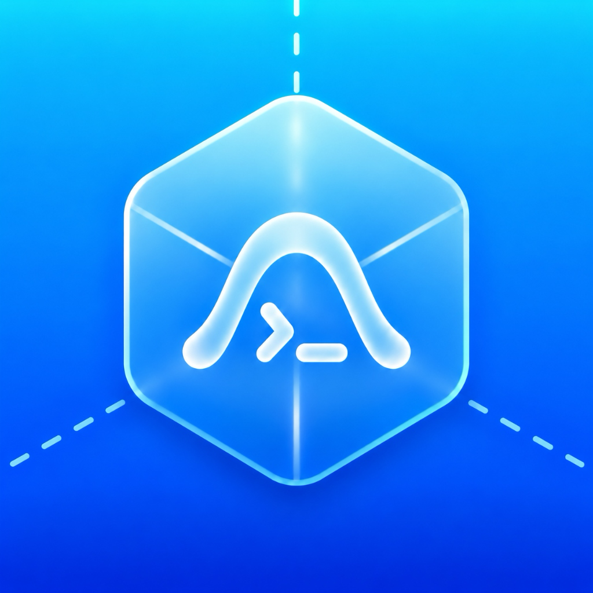
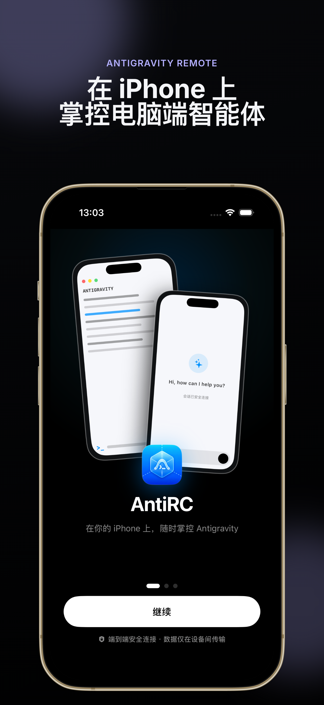
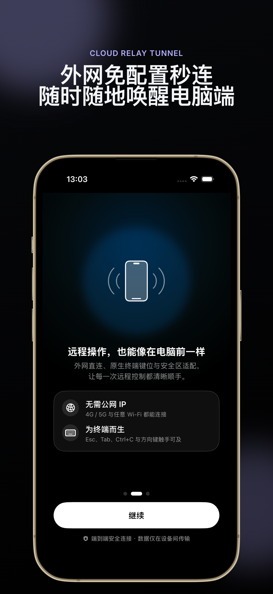
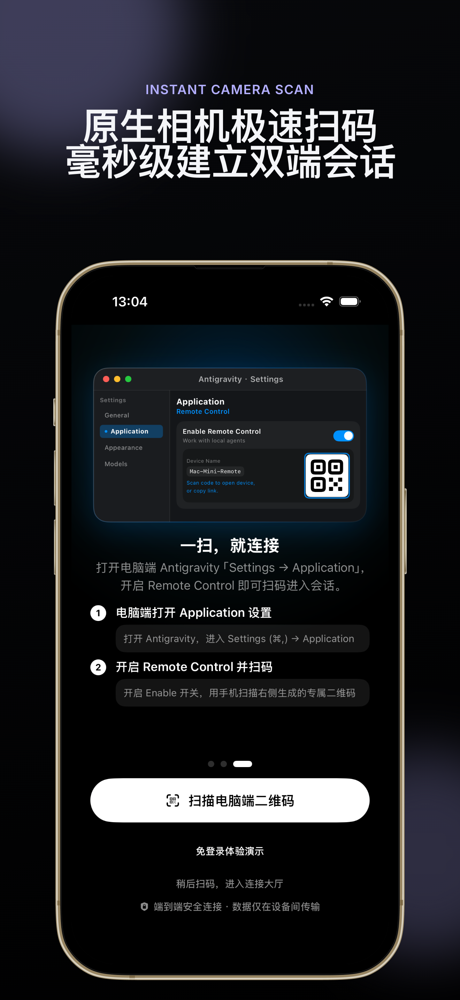
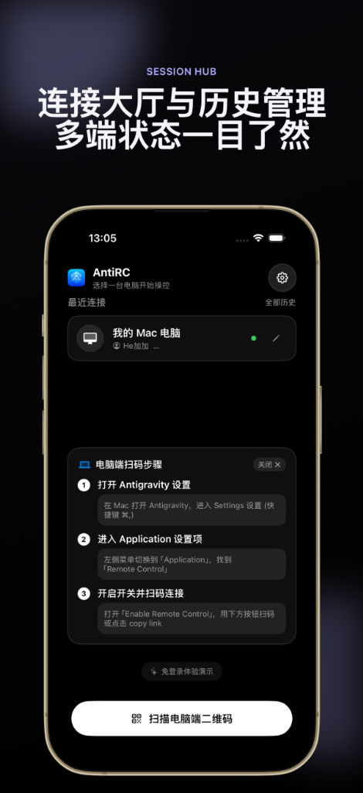
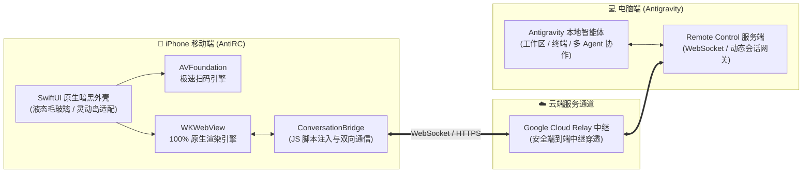

# AntiRC - Antigravity 专属 iOS 远程控制器 (Antigravity Remote)

<p align="center">
  
</p>

<p align="center">
  <strong>在你的 iPhone 上，掌控电脑端的 Antigravity</strong>
  <br>
  <em>告别笨重远程桌面，专为 Google Antigravity 打造的高颜值、高性能移动端控制器</em>
</p>

<p align="center">
  <a href="https://testflight.apple.com/join/wbDWtfqF"></a>
  
  
  
</p>

---

### ⚡ 快速开始：选择适合你的使用方式

* 📲 **[普通用户 / 极速体验]**：**[点击直接加入 TestFlight 公测](https://testflight.apple.com/join/wbDWtfqF)**（无需 Mac 电脑，iPhone 点击即可下载体验）。
* 🛠️ **[开发者 / 自主可控]**：**[跳转至本地源码编译与部署教程](#-本地编译与源码自部署)**（基于 Xcode 轻松完成个人真机部署与二次开发）。

---

## 📱 视觉画廊 (Showcase)

<p align="center">
  
  &nbsp;
  
  &nbsp;
  
  &nbsp;
  
</p>

<p align="center">
  <em>从左至右依次为：移动端掌控 Antigravity、云端中继外网秒连、原生相机扫码极速握手、多设备管理与免登录沙盒</em>
</p>

---

## 🌟 核心特性详解

### 1. 🤖 在 iPhone 上掌控电脑端的 Antigravity (Antigravity Remote)
<table>
  <tr>
    <td width="35%"></td>
    <td width="65%">
      <ul>
        <li><strong>告别传统远程桌面</strong>：摆脱 VNC、TeamViewer 等远程桌面在手机上字体模糊、操作卡顿、输入法错位的糟糕体验。</li>
        <li><strong>专为移动端交互定制</strong>：基于原生 SwiftUI 外壳与轻量 WebKit 深度融合，支持单手流畅手势、液态毛玻璃导航栏。</li>
        <li><strong>原生快捷操作</strong>：支持一键「新建对话」、模型快速切换、实时会话状态监控与代码变更（Diff）审查。</li>
        <li><strong>灵动岛与安全区适配</strong>：自动避让 iPhone 灵动岛、刘海与底部手势条，视口自适应不产生多余黑边。</li>
      </ul>
    </td>
  </tr>
</table>

### 2. 🌐 外网免配置秒连 · 随时随地唤醒电脑端 (Cloud Relay)
<table>
  <tr>
    <td width="35%"></td>
    <td width="65%">
      <ul>
        <li><strong>无需公网 IP / 端口映射</strong>：依托 Antigravity 官方安全的云端中继通道，告别复杂的内网穿透（FRP、Ngrok）配置。</li>
        <li><strong>全网段随时连接</strong>：出门在外处于 4G / 5G 移动蜂窝网络，或连接酒店、咖啡厅 Wi-Fi，均可随时秒连家中或公司电脑。</li>
        <li><strong>为终端交互而生</strong>：专为终端和编程场景设计，手势操作流畅顺手，外出也能时刻掌控 Agent 任务进度。</li>
        <li><strong>防休眠与长时间监控</strong>：支持在设置中开启「保持屏幕常亮」，方便将手机置于桌面作为副屏监视长时间任务。</li>
      </ul>
    </td>
  </tr>
</table>

### 3. ⚡ 原生相机扫码 · 快速建立会话 (Fast Connect)
<table>
  <tr>
    <td width="35%"></td>
    <td width="65%">
      <ul>
        <li><strong>硬件级相机流识别</strong>：基于 iOS AVFoundation 框架底层深度开发，开启后毫秒级捕获屏幕二维码，对准即连接。</li>
        <li><strong>告别手动输入长链接</strong>：电脑端生成的复杂 Session Token 链接无需微信/邮件复制中转，扫一扫即可无缝接入。</li>
        <li><strong>智能剪贴板一触即连</strong>：支持剪贴板自动探测，从其他聊天软件复制远程控制 URL 后切回 App，顶部自动弹出高亮连接胶囊。</li>
        <li><strong>细腻触觉反馈</strong>：扫码成功、按键触发与会话切换均经过 Taptic Engine 精准调校，带来极佳的物理震动反馈。</li>
      </ul>
    </td>
  </tr>
</table>

### 4. 🗂️ 连接大厅与历史管理 · 多端状态一目了然 (Session Hub)
<table>
  <tr>
    <td width="35%"></td>
    <td width="65%">
      <ul>
        <li><strong>多设备管理与快速切换</strong>：自动持久化保存历史连接，支持给设备自定义重命名（如“工位 Mac Studio”、“个人 MacBook”）。</li>
        <li><strong>实时在线状态指示</strong>：直观显示设备在线与握手状态指示灯，一键重连或删除失效设备。</li>
        <li><strong>免登录体验沙盒</strong>：首次下载或手头暂无电脑设备时，可一键进入免登录本地演示沙盒，体验完整对话与用量面板。</li>
        <li><strong>防 Google 登录拦截</strong>：内置针对 WebKit 用户代理（User-Agent）及 Passkey 策略的优化，彻底规避 <code>403 disallowed_useragent</code> 拦截问题。</li>
      </ul>
    </td>
  </tr>
</table>

---

## 📲 方式一：TestFlight 直接安装使用（推荐）

无需准备 Mac 电脑、无需安装 Xcode 编译，适合绝大多数用户快速上手体验：

1. **安装 TestFlight**：在 iPhone 的 App Store 中搜索并安装 Apple 官方的 **TestFlight** 应用；
2. **加入公测计划**：在 iPhone 的 Safari 浏览器中打开公测邀请链接：  
   👉 **[https://testflight.apple.com/join/wbDWtfqF](https://testflight.apple.com/join/wbDWtfqF)**
3. **接受并安装**：在 TestFlight 中点击「接受」，然后点击「安装」**AntiRC**；
4. **配对连接**：按照下方的[电脑端设置教程](#-电脑端开启远程控制)生成二维码，使用手机扫码即可立即开始体验！

---

## 💻 电脑端开启远程控制

在手机端连接之前，请先在电脑（Mac / Windows / Linux）端启动 Antigravity 的远程控制功能：

### 方法 1：在 Antigravity 客户端设置中开启（推荐）
1. 打开电脑端 **Antigravity**；
2. 按快捷键 `⌘,`（Windows 为 `Ctrl+,`）打开 **Settings** 设置窗口；
3. 左侧导航栏选择 **Application**；
4. 找到 **Remote Control** 栏目，打开 **Enable Remote Control** 开关；
5. 界面随即生成当前设备的专属二维码与连接链接。

### 方法 2：通过终端命令行开启
```bash
# 启动 Antigravity 并开启远程控制监听
antigravity --remote
```
终端将自动输出专属连接 URL 及二维码。

---

## 🛠️ 方式二：本地编译与源码自部署

如果您是 iOS 开发者，或者希望基于源码进行二次开发、完全自主部署：

### 环境准备
- 苹果电脑：macOS Sonoma 14.0+ 或 Sequoia 15.0+
- 开发工具：Xcode 15.0+（支持 iOS 17.0 SDK 及以上）
- 开发者账号：普通的个人免费 Apple ID 即可调试真机

### 编译部署步骤
1. **克隆仓库源码**：
   ```bash
   git clone https://github.com/heranhe/AntigravityRemote.git
   cd AntigravityRemote
   ```

2. **使用 Xcode 打开工程**：
   ```bash
   open AntigravityRemote.xcodeproj
   ```

3. **配置个人签名 (Signing)**：
   - 在 Xcode 左侧导航栏选中顶部的蓝标工程 `AntigravityRemote`；
   - 在中央区域选中 Target **AntigravityRemote**，点击 **Signing & Capabilities** 选项卡；
   - 在 **Team** 下拉列表中选择你的个人 Apple 账号（或个人开发团队）；
   - 如提示 Bundle Identifier 冲突，可将 `Bundle Identifier`（如 `com.heran.AntigravityRemote`）后缀修改为你独有的标识。

4. **连接真机并运行**：
   - 使用 USB 数据线或同一局域网 Wi-Fi 将 iPhone 连接至 Mac；
   - 在 Xcode 顶部设备运行目标中选择你的 iPhone；
   - 点击顶部 ▶️ **Run**（或快捷键 `⌘R`），Xcode 会自动构建并部署至手机；
   - *(注：首次部署需在 iPhone 上进入「设置 -> 通用 -> VPN 与设备管理」中信任开发者证书)*。

---

## 🏗️ 系统架构设计



---

## 📁 项目目录结构

```text
AntigravityRemote/
├── AntigravityRemote.xcodeproj/        # Xcode 项目工程文件
├── AntigravityRemote/
│   ├── AntigravityRemoteApp.swift      # App 入口生命周期与环境注入
│   ├── Info.plist                      # 权限声明（相机扫码等）与构建配置
│   ├── Models/
│   │   ├── ConnectionRecord.swift      # 设备连接历史与状态数据模型
│   │   └── AppSettings.swift           # 全局偏好设置与防休眠控制
│   ├── Utils/
│   │   ├── HapticManager.swift         # Taptic Engine 系统震动触觉反馈
│   │   └── UserAgentHelper.swift       # 移动端视口与防拦截 UA 适配
│   ├── Conversation/
│   │   ├── NativeConversationView.swift # 远程会话容器视图（支持新建对话）
│   │   ├── DemoConversationView.swift   # 免登录离线体验沙盒
│   │   └── ConversationBridge.swift     # WebKit 脚本桥接层（双向消息派发）
│   ├── Views/
│   │   ├── MainContainerView.swift     # 状态分发与路由容器
│   │   ├── ConnectView.swift           # 开屏引导、连接大厅与扫码调度
│   │   ├── QRScannerView.swift         # AVFoundation 原生毫秒级相机扫码
│   │   ├── RemoteWebView.swift         # WKWebView 渲染与手势交互
│   │   ├── HistoryView.swift           # 设备连接历史管理面板
│   │   └── SettingsView.swift          # 偏好设置面板
│   └── Assets.xcassets/                # App 图标与主题设计资源
├── docs/
│   └── screenshots/                    # 界面高保真展示海报
├── screenshots-studio/                 # 基于 Next.js 的高保真宣发截图工作台
└── README.md                           # 开源项目说明文档
```

---

## ❓ 常见问题 (FAQ)

<details>
<summary><strong>Q: 必须要在同一个局域网（Wi-Fi）下才能连接吗？</strong></summary>

**A: 完全不需要！**  
Antigravity 的 Remote Control 原生基于 Google Cloud 安全中继穿透。只要电脑端已开启 Remote Control 并且保持联网，手机无论是在 4G/5G 蜂窝移动网络下，还是在任何其他 Wi-Fi 网络下，都可以随时直连，无需任何路由器端口映射或公网 IP。
</details>

<details>
<summary><strong>Q: 登录 Google 账号时提示“需要打开蓝牙”？必须要开蓝牙吗？</strong></summary>

**A: 不需要蓝牙！AntiRC 本身完全基于纯网络运行，代码中没有任何蓝牙权限或调用。**  
- **为什么会出现提示？** 这是 Google 账号通行密钥 (Passkey / WebAuthn) 在检测周围设备距离时由 iOS 系统 WebKit 弹出的通用提示。  
- **如何处理？** 在网页弹出的验证面板上，点击 **「尝试其他方式 (Try another way)」** -> 选择 **密码登录** 或 **Google 验证器**；或者临时打开手机蓝牙开关（无需配对任何设备）即可快速完成 Passkey 本地核验。
</details>

<details>
<summary><strong>Q: 手机锁屏后会中断连接吗？</strong></summary>

**A:**  
iOS 系统会在锁屏或切换到后台数分钟后挂起网络连接。为了在长时间任务（如重构代码、自动测试）时持续监视 Agent 状态，建议在 App 的 **设置 (Settings)** 中打开 **「保持屏幕常亮 (Keep Screen On)」**，将 iPhone 作为电脑副屏使用。
</details>

---

## 🤝 贡献与反馈

欢迎提交 Issue 或 Pull Request 来共同完善 AntiRC！
- 提交 Bug 或功能建议：[GitHub Issues](https://github.com/heranhe/AntigravityRemote/issues)
- 遵循现有的 Swift 代码规范，提交清晰规范的 Commit 记录。

---

## 📄 开源许可证

本项目基于 [MIT License](LICENSE) 许可协议开源。您可以自由使用、修改和分发，商业及个人用途均可。
