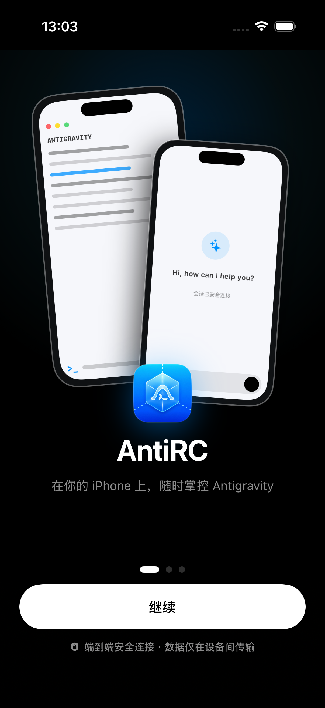
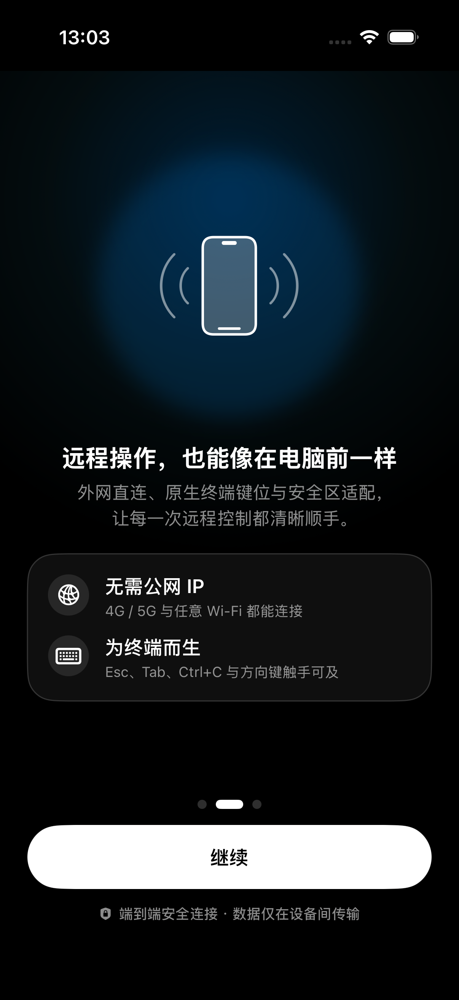
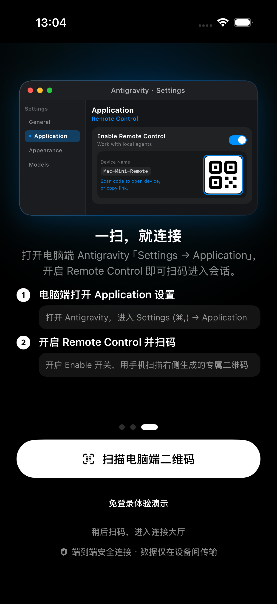
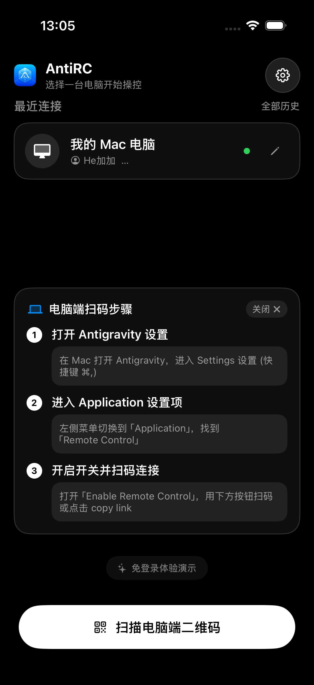

# AntiRC - Antigravity 专属 iOS 远程控制器 (Antigravity Remote)

<p align="center">
  
</p>

<p align="center">
  <strong>在你的 iPhone 上，随时随地掌控电脑端 Antigravity 智能体</strong>
</p>

<p align="center">
  
  
  
  
</p>

---

## 📱 界面预览

<p align="center">
  
  &nbsp;&nbsp;
  
  &nbsp;&nbsp;
  
  &nbsp;&nbsp;
  
</p>

<p align="center">
  <em>从左至右依次为：开屏双端预览、核心特性介绍、电脑端扫码指引、连接大厅设备管理</em>
</p>

---

## 🌟 核心特性

1. **🌐 外网免配置秒连**
   - 官方 Remote Control 借助 Google Cloud 中继穿透，手机处于 4G/5G 蜂窝网络或任意外部 Wi-Fi，均无需公网 IP、端口映射或内网穿透即可直连电脑端。

2. **⚡ 原生相机极速扫码**
   - 基于系统级 AVFoundation 框架构建，毫秒级识别电脑终端或 IDE 弹出的二维码，对准屏幕扫码秒连，告别手机端手动键入长链接。

3. **📋 智能剪贴板一触即连**
   - 复制电脑发送的远程控制 URL 后切回 App，顶部自动弹出高亮快捷连接胶囊，轻触即可进入会话。

4. **🏝️ 灵动岛与安全区深度自适应**
   - 智能注入 Viewport 与 CSS 适配，完美规避灵动岛、刘海与底部手势条遮挡，并支持在设置中开启/关闭安全区避让模式。

5. **🖤 原生深色模式与加载优化**
   - 全链路纯黑沉浸式 UI，彻底消除网页加载期间的白色闪烁；会话顶部保留高质感液态毛玻璃导航栏，优雅掌控连接状态与多端会话。

6. **✨ 免登录体验演示**
   - 首次安装或无电脑设备在旁时，支持一键进入免登录本地演示沙盒，体验完整会话交互、模型切换、用量看板等核心流程。

7. **🛡️ 避免 Google 账号登录 403 拦截**
   - 针对内嵌 WebKit 登录 Google 账号常见拦截（`403 disallowed_useragent`）进行底层优化，与系统 Safari 认证共用状态，远离蓝牙安全密钥拦截困扰。

8. **📳 原生 Taptic Engine 触觉震动反馈**
   - 扫码识别、按键轻按、下拉刷新与连接状态切换均经过精准调校的细腻触觉震动反馈。

9. **🌙 防休眠与长时间任务监控**
   - 手机作为副屏监视电脑端 Antigravity 长时间运行任务、代码重构或自动测试时，保持屏幕常亮不中断。

10. **🗂️ 多设备历史记录与快捷重连**
    - 自动记忆近期连接过的多台设备，支持重命名备注（如“工位 Mac mini”、“个人 MacBook”），多设备切换得心应手。

---

## 📲 TestFlight 公开测试参与

您可以通过以下公开测试链接，在 iPhone 上直接安装最新的 Beta 测试版本：

🔗 **[加入 AntiRC TestFlight 测试](https://testflight.apple.com/join/wbDWtfqF)**

*(要求 iPhone 运行 iOS 17.0 或更高版本)*

---

## 💻 电脑端使用指引

在使用手机端连接之前，请先在您的电脑（Mac / Linux / Windows）上运行 Antigravity：

### 方式一：在 Antigravity 桌面客户端中开启
1. 打开电脑端 Antigravity；
2. 按快捷键 `⌘,`（Windows 为 `Ctrl+,`）打开 **Settings** 设置窗口；
3. 左侧切换至 **Application** 分类；
4. 找到 **Remote Control** 选项，打开 **Enable** 开关；
5. 屏幕右侧即会显示当前设备的连接二维码与 URL。

### 方式二：在终端中通过命令行开启
```bash
# 启动并开启远程控制模式
antigravity --remote
```
终端将自动输出专属连接 URL 及二维码。

### 手机端连接：
打开 iPhone 上的 **AntiRC App**，点击底部的 **「扫描电脑端二维码」**，对准电脑屏幕扫码即可瞬间连接！

---

## 🛠️ 本地编译与真机调试

如果您希望自行编译源码并在个人 iPhone 上调试运行：

### 环境要求
- macOS Sonoma 14.0+ 或 Sequoia 15.0+
- Xcode 15.0+（支持 iOS 17 SDK 及以上）
- 拥有个人免费 Apple ID 即可调试

### 步骤指引
1. 克隆代码仓库到本地：
   ```bash
   git clone https://github.com/heranhe/AntigravityRemote.git
   cd AntigravityRemote
   ```
2. 双击打开 Xcode 工程文件：
   ```bash
   open AntigravityRemote.xcodeproj
   ```
3. 在 Xcode 导航栏中选中顶部的 **AntigravityRemote** Target：
   - 进入 **Signing & Capabilities** 选项卡；
   - 在 **Team** 下拉框中选择你的个人 Apple 账号；
   - 如 Bundle Identifier 冲突，可微调为自定义标识。
4. 使用数据线将 iPhone 连接至电脑，在顶部设备选择器中选中你的真机，点击 ▶️ **Run** 即可安装。

---

## 📁 项目目录结构

```text
AntigravityRemote/
├── AntigravityRemote.xcodeproj/        # Xcode 项目工程文件
├── AntigravityRemote/
│   ├── AntigravityRemoteApp.swift      # App 入口生命周期与环境注入
│   ├── Info.plist                      # 隐私权限（相机）与系统配置
│   ├── Models/
│   │   ├── ConnectionRecord.swift      # 远程设备连接状态与历史模型
│   │   └── AppSettings.swift           # 全局持久化设置与防休眠控制
│   ├── Utils/
│   │   ├── HapticManager.swift         # 系统级 Taptic Engine 震动反馈
│   │   └── UserAgentHelper.swift       # URL 校验与防拦截 UA 适配
│   ├── Conversation/
│   │   ├── NativeConversationView.swift # 远程全屏会话容器与毛玻璃顶栏
│   │   ├── DemoConversationView.swift   # 免登录离线体验沙盒会话
│   │   └── ConversationBridge.swift     # WebKit 脚本桥接层
│   ├── Views/
│   │   ├── MainContainerView.swift     # 状态路由容器
│   │   ├── ConnectView.swift           # 开屏引导、连接大厅与扫码调度
│   │   ├── QRScannerView.swift         # AVFoundation 原生毫秒级相机扫码
│   │   ├── RemoteWebView.swift         # 纯净版 WKWebView 渲染与手势交互
│   │   ├── HistoryView.swift           # 设备连接历史管理面板
│   │   └── SettingsView.swift          # 偏好设置面板
│   └── Assets.xcassets/                # 品牌图标与全色系资产
├── docs/
│   └── screenshots/                    # 界面高保真展示图
└── README.md                           # 项目说明文档
```

---

## ❓ 常见问题 (FAQ)

<details>
<summary><strong>Q: 登录 Google 账号时提示“蓝牙连接有问题”？必须要开蓝牙吗？</strong></summary>

**A: 绝对不需要蓝牙！AntiRC 本身完全基于纯网络（Wi-Fi 或蜂窝数据）运行，代码中没有任何蓝牙权限或调用。**

- **为什么会出现提示？**  
  在 Google 账号或企业 SSO 登录流程中，系统安全策略可能会优先尝试「通行密钥 (Passkey)」或「物理安全密钥 (FIDO2)」。跨设备验证时 WebAuthn 规范会尝试通过蓝牙低功耗探测设备物理距离。
- **如何彻底解决？**  
  1. 在网页弹出的验证面板上，点击 **「尝试其他方式 (Try another way)」** -> 选择 **密码登录**、**Google 验证器** 或 **短信/App 确认**，直接走纯网络通道验证。  
  2. 若要使用通行密钥，仅需顺手在 iPhone 控制中心把蓝牙开关打开（无需配对任何设备），系统即可自动完成本地握手。
</details>

<details>
<summary><strong>Q: 为什么文字看起来比电脑上稍微紧凑？</strong></summary>

**A:**  
Antigravity 网页版是面向桌面大屏幕（1080P/4K）设计的专业单页 IDE。本应用采用了完全原汁原味的原生 100% 渲染模型，确保底部输入框、浮动按钮和代码视图始终精准吸附、绝不移位或被遮挡。
</details>

---

## 📄 开源许可证

本项目基于 [MIT License](LICENSE) 许可协议开源。
